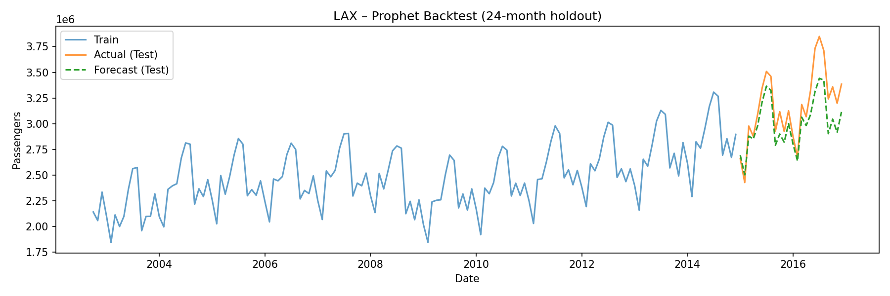
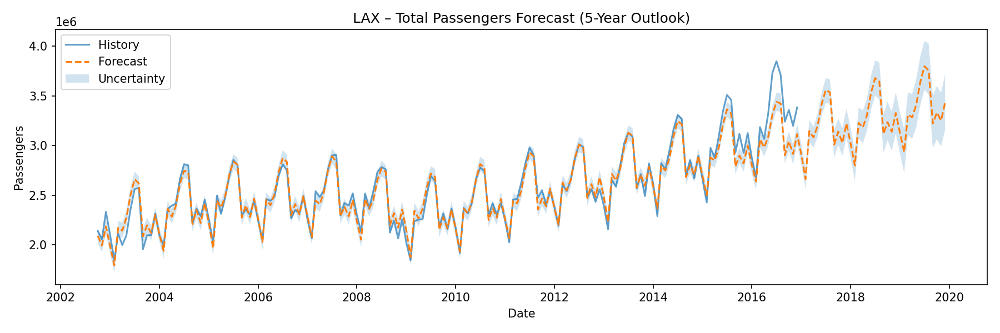
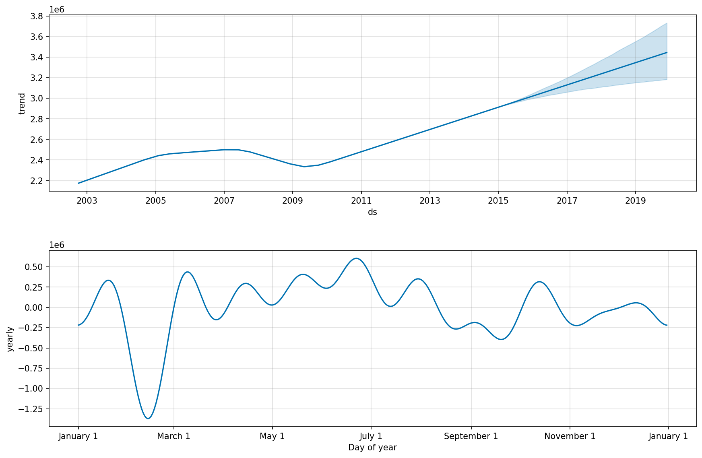

# 📈 LAX Airport – Growth Prediction (2002–2017)

**Time-Series Forecasting with Prophet**

This project demonstrates end-to-end airport passenger forecasting using historic monthly traffic data for **Los Angeles International Airport (LAX)**.
The goal is to showcase data cleaning, metric engineering, time-series modelling, backtesting, visualization, and forecasting skills suitable for recruiters and portfolio reviewers.

---

## 🗂 Project Structure

```
Project_D_LAX_Airport_Growth_Prediction/
│
├── data/
│   └── raw/
│       └── all_airlines-LAX.csv
│
├── images/
│   ├── lax_prophet_backtest_24m.png
│   ├── lax_prophet_components.png
│   ├── lax_prophet_forecast_5y.png
│   └── lax_total_passengers.png
│
├── notebooks/
│   ├── 01_data_preparation.ipynb
│   └── 02_forecasting_lax.ipynb
│
├── output/
│   └── clean/
│       └── all_airlines_lax_clean.csv
│
├── README.md
└── requirements.txt
```

---

## 📊 Dataset Overview

**Source:** Monthly LAX passenger statistics (all airlines combined)  
**Period Covered:** **2002-10 to 2017-03**  
**Columns Included:**

* Domestic / International Passengers
* Domestic / International Flights
* ASM / RPM metrics
* Total passengers (created during cleaning)

This dataset predates COVID-19; forecasts here reflect historical patterns **only up to 2017**.

---

## 🧹 1. Data Preparation

*All work in `01_data_preparation.ipynb`*

### Key Steps

* Load raw CSV (`data/raw/all_airlines-LAX.csv`)
* Parse dates into monthly periods (`MS`)
* Standardise column names to snake_case
* Create total metrics:

  * `pax_total`
  * `flights_total`
  * `asm_total`
  * `rpm_total`
* Ensure continuous month-to-month index
* Remove missing rows when needed
* Save cleaned dataset to:

```
output/clean/all_airlines_lax_clean.csv
```

### Sanity Check Plot

A quick visualization was used to confirm dataset continuity and expected seasonality.

---

## 🤖 2. Forecasting Pipeline

*All work in `02_forecasting_lax.ipynb`*

### Model Used

**Prophet (Meta)**

* Yearly seasonality enabled
* Daily/weekly seasonality disabled (not relevant for monthly data)

### Train/Test Split

A **24-month holdout** period was used for backtesting:

* **Train:** 2002-10 → 2015-03
* **Test:** 2015-04 → 2017-03

---

## 📐 3. Backtest Performance (24-month holdout)

| Metric   | Value              |
| -------- | ------------------ |
| **MAE**  | 175,934 passengers |
| **RMSE** | 209,874 passengers |
| **MAPE** | **5.31%**          |

Performance is strong given airport-level macro data and no exogenous variables.

### Backtest Plot

Shows actual vs forecast during the 24-month unseen window:



---

## 🔮 4. 5-Year Growth Forecast

The model projects a steady upward trend based entirely on 2002–2017 historical patterns.



---

## 🌀 5. Seasonality & Trend Components

Prophet’s decomposition reveals:

* **Strong annual seasonality** (peak: Jul–Aug)
* **Clear long-term upward trend**
* **No weekly/daily components** (disabled)



---

## 📝 6. Key Insights

### **1. Clear Growth Trend (2002–2017)**

LAX experienced steady growth driven by both domestic and international demand.

### **2. Well-defined Seasonality**

Summer months show strong peaks; February is consistently the lowest traffic month.

### **3. Model Fit is Strong**

MAPE of **5.31%** indicates robust predictive ability for airport-level forecasting.

### **4. Forecast Limitations**

Since the dataset ends in early 2017:

* The model does *not* capture 2017–2019 rapid growth
* Nor the 2020 COVID collapse and 2021–2024 rebound
* Real LAX traffic reached **76.6M** passengers by 2024, far above the ~40M predicted by historic-only data

This is intentional — the goal is demonstrating modelling, not replicating real-world 2024 numbers.

---

## 📦 7. Tech Stack

* **Python 3.x**
* **Prophet (Meta)**
* **pandas, numpy**
* **matplotlib**
* **scikit-learn**
* **Jupyter Notebooks**

---

## 📄 8. Installation & Requirements

Install dependencies:

```bash
pip install -r requirements.txt
```

Minimal `requirements.txt`:

```
pandas
numpy
matplotlib
prophet
scikit-learn
```

---

## 🧭 9. How to Run

1. Open `01_data_preparation.ipynb`
2. Run all cells → generates cleaned dataset
3. Open `02_forecasting_lax.ipynb`
4. Fit Prophet model, evaluate, generate visuals
5. View plots in `/images` folder
6. Forecast & insights ready for your portfolio

---

## ✔ Summary

This project showcases an end-to-end workflow for **airport passenger forecasting** using a controlled dataset.
It demonstrates:

* Data wrangling
* Time-series modelling
* Backtesting
* Seasonality analysis
* Forecast visualization
* GitHub-ready project structure
